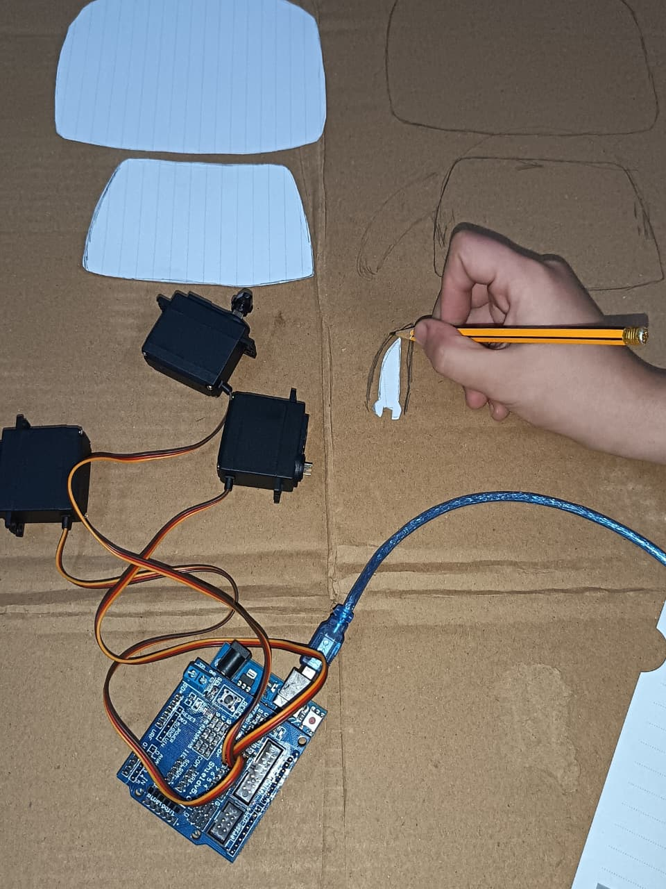
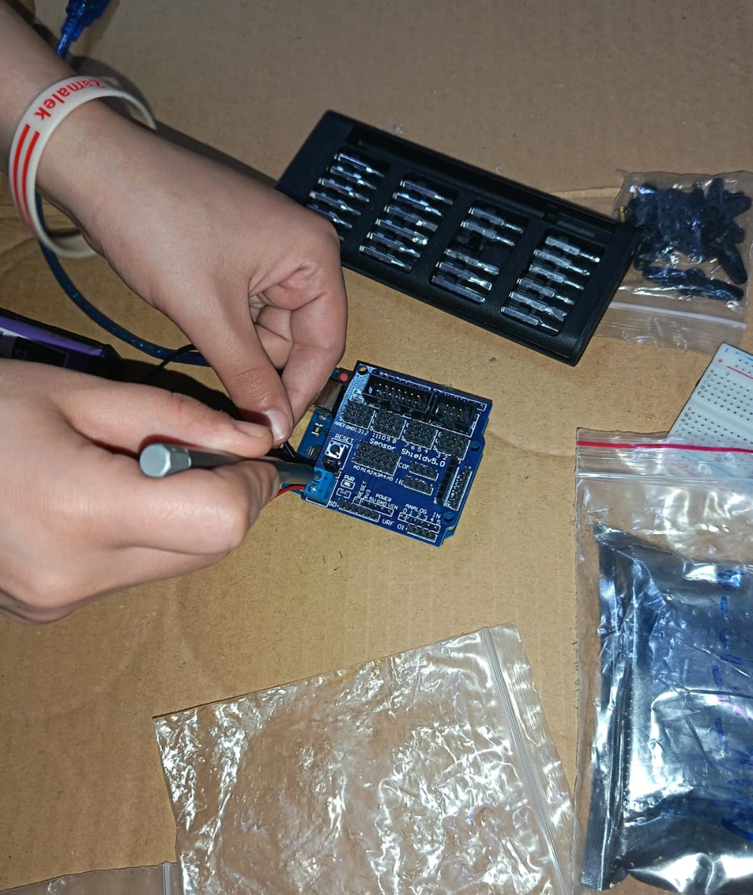
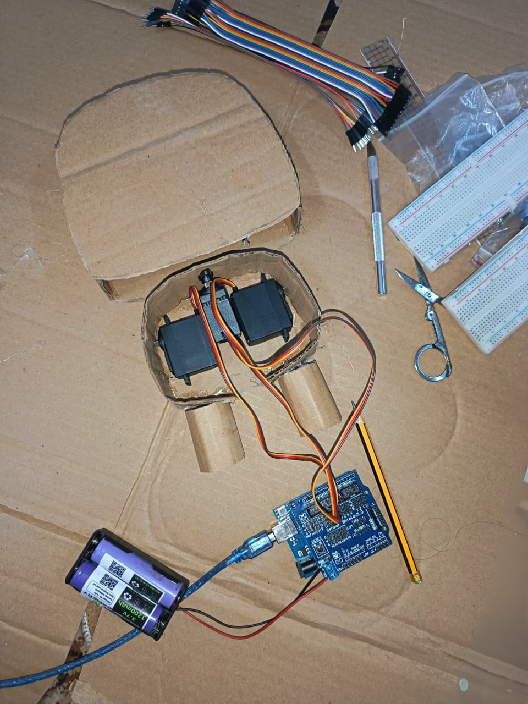
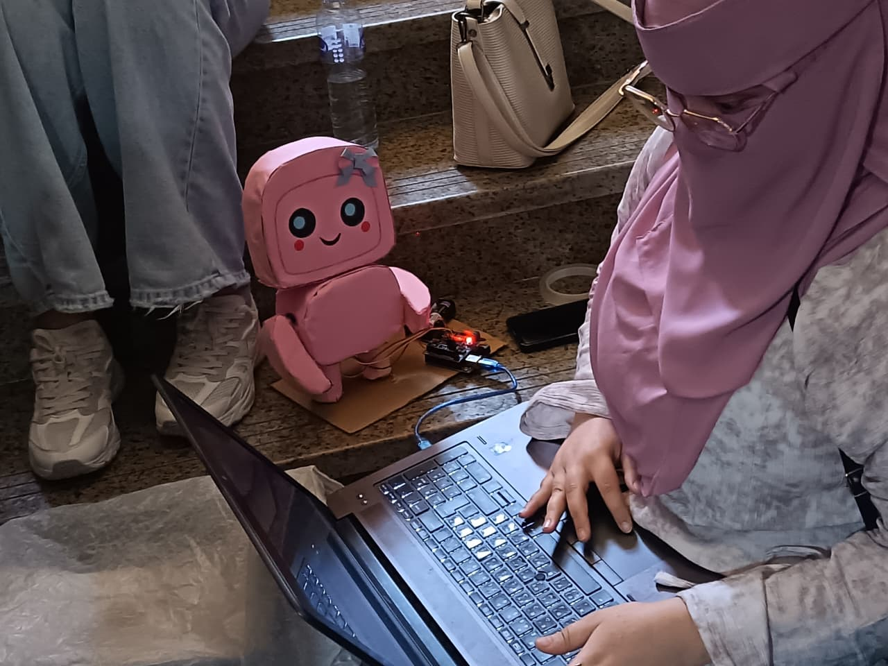

# 🤖 Speech controlled Intelligent robot

## 📌 Overview
This project is a simple AI assistant built using Python that can interact with users through both text and voice input. It generates responses using basic AI techniques such as speech recognition and text-to-speech, creating a small interactive intelligent agent.

---

## 🚀 Features
- 🗣️ Voice input using speech recognition  
- 💬 Text-based interaction  
- 🔊 Text-to-speech (TTS) responses  
- 🤖 Basic AI response generation  
- ⚡ Simple and lightweight implementation  

---

## 🧠 How It Works
The assistant is built by integrating multiple components:

### 1. Speech Recognition
- Converts user voice input into text  
- Uses Python libraries like: `speech_recognition`  

### 2. Text Processing
- Takes input (voice or text)  
- Processes it using simple logic or predefined responses  
- Can be extended using AI models or APIs  

### 3. Response Generation
- Generates responses based on:  
  - Keywords  
  - Simple rules  
  - Basic AI logic  

### 4. Text-to-Speech (TTS)
- Converts the generated response into audio output  

---
# 🤖 AI Voice Robot - Project Guide

## 📌 Overview

This project is an AI-powered interactive robot that:

* Listens to user speech 🎤
* Converts speech to text
* Generates intelligent responses using Google Gemini
* Converts responses to speech 🔊
* Controls a physical robot using Arduino 🤖

---

## 📁 Project Structure

Make sure your project is organized as follows:

* `Step1_VOSK.py` → Speech-to-Text (Offline)
* `Step2_Gemini.py` → AI Response
* `Step3_TTS.py` → Text-to-Speech
* `Main_System.py` → Full integrated system
* `Arduino_Code.ino` → Arduino servo control
* `cvzone.h / cvzone.cpp` → Serial communication
* `Resources/`

  * VOSK model
  * sound effects
  * generated speech files

---

## ⚙️ Setup Instructions

### 1️⃣ Install Required Libraries

### Python:

```bash
pip install vosk pyaudio pygame edge-tts google-generativeai cvzone
```

### Arduino:

* Install Servo library (built-in)
* Add cvzone files to Arduino project

---

## 🔌 Hardware Setup

* Connect 3 Servo Motors to Arduino:

  * Pin 8 → Left Arm
  * Pin 9 → Right Arm
  * Pin 10 → Head
* Connect Arduino to your computer via USB

---

## 🚀 How to Run the Project (IMPORTANT ORDER)

### ✅ Step 1: Upload Arduino Code

* Open `Arduino_Code.ino`
* Upload it to Arduino using Arduino IDE
* Make sure Serial baud rate matches Python (e.g. 9600)

---

### ✅ Step 2: Test Serial Communication

* Run simple Python script (send test values)
* Check Serial Monitor for received data

---

### ✅ Step 3: Test Speech-to-Text

Run:

```bash
python Step1_VOSK.py
```

* Speak and verify text output

---

### ✅ Step 4: Test AI Response

Run:

```bash
python Step2_Gemini.py
```

* Verify AI response generation

---

### ✅ Step 5: Test Text-to-Speech

Run:

```bash
python Step3_TTS.py
```

* Confirm audio output works

---

### ✅ Step 6: Run Full System

```bash
python Main_System.py
```

Now the robot will:

1. Listen 🎤
2. Understand 🧠
3. Respond 🔊
4. Move 🤖

---

## 🎯 Notes & Tips

* Make sure microphone is working
* Check COM port for Arduino
* Ensure VOSK model path is correct
* Replace your Gemini API key (DO NOT upload it publicly ⚠️)

---

## ⚠️ Common Issues

* No sound → check pygame / audio device
* No movement → check Arduino connection
* Wrong speech → adjust microphone noise settings
* Delay → reduce buffer size or improve hardware

---

## 💡 Future Improvements

* Add wake word (e.g., "Hey Emma")
* Add face detection
* Add more gestures
* Improve real-time performance

---

## 🧠 Concept Summary

This project demonstrates how to integrate:

* AI models
* Speech processing
* Hardware control

into a single interactive robotic system.

---

## 🌍 Real-World Applications

This project demonstrates a practical integration of artificial intelligence, speech processing, and hardware control, which makes it applicable in several real-world domains.

### 🤖 Smart Assistive Robots

The system can be used as a foundation for building interactive assistant robots that communicate with users through voice. Similar concepts are used in smart assistants powered by technologies like Google Assistant, but extended here to include physical movement and gestures.

It provides a hands-on way to understand how systems like Google Gemini can be integrated into real applications.

### 🏠 Smart Home Integration

The system can be extended to control smart home devices using voice commands. Instead of just responding verbally, the robot can physically interact or indicate actions, making the experience more engaging.

### 🎭 Human-Robot Interaction (HRI)

This project is a basic model of Human-Robot Interaction systems, where machines not only process commands but also respond with gestures and voice. This is important in fields like customer service robots and reception assistants.


---

## 💡 Key Idea

The main value of this project lies in transforming digital input (speech) into both:

* Intelligent responses 🧠
* Physical actions 🤖

which bridges the gap between software intelligence and real-world interaction.

## 📸 Images










---

## 📸 Videos


